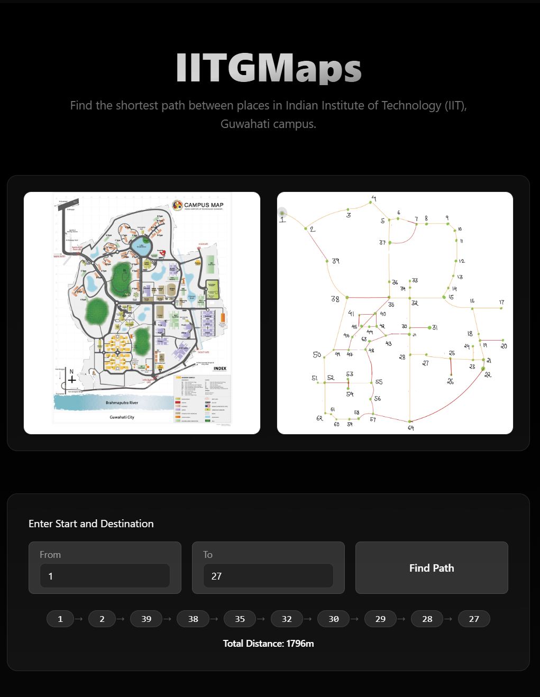

# IITGMaps

IITGMaps is an interactive web application that helps users find the shortest path between two points on the Indian Institute of Technology (IIT) Guwahati campus using Dijkstra's algorithm.

## Screenshots

### Path Finding Interface

*Working interface showing path calculation from node 1 to node 27 with total distance of 1796m*


## Getting Started

You can run IITGMaps either with Docker Compose (recommended) or manually.

### 1. Running with Docker Compose

**Prerequisites:**  
- [Docker](https://www.docker.com/get-started) and [Docker Compose](https://docs.docker.com/compose/install/) installed

**Steps:**
```sh
git clone https://github.com/yourusername/IITGMaps.git
cd IITGMaps
docker-compose up --build
```
- The client will be available at [http://localhost:5173](http://localhost:5173).
- The server will run on [http://localhost:3000](http://localhost:3000).

**Note:**  
If you see an error about a missing `.env` file in the `server` directory, create a file named `.env` inside `server/` with the following content:
```
PORT=3000
FRONTEND_URL=http://localhost:5173
NODE_ENV=development
```

### 2. Running Manually (Without Docker)

#### A. Start the Server

```sh
cd server
npm install
npm start
```

#### B. Start the Client

Open a new terminal window:

```sh
cd IITGMapsClient
npm install
npm run dev
```

The client will be available at [http://localhost:5173](http://localhost:5173).

